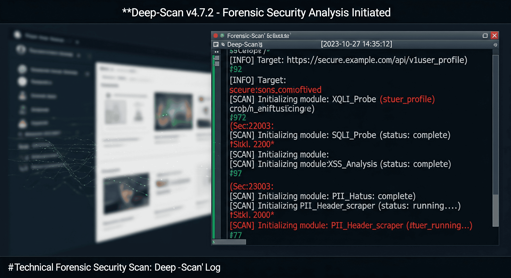

# Forensic Deep-Scan — Case Study (Docs-only)

## Overview
A forensic security analysis workflow designed to detect sensitive data exposure, correlate signals across logs and endpoints, and produce actionable remediation steps under incident conditions.

## What I Built
- Deep-scan pipeline for log collection, normalisation, and correlation
- Detection modules for common web attack surfaces (SQLi, XSS, header abuse)
- PII leak detection routines with rule-based classification
- Evidence-focused reporting format with traceable findings and timelines

## Key Outcomes
- Reduced time-to-triage by standardising signals into a single investigation view
- Improved finding accuracy via deterministic correlation rules
- Enabled repeatable incident response runs through replayable scan logs

## Architecture Highlights
- **Collectors:** endpoint + application log ingestion
- **Normalisation:** schema mapping into a unified event model
- **Correlation:** rule engine + timelines + dedupe keys
- **Detection:** modular probes (SQLi, XSS, PII, header anomalies)
- **Output:** forensic log + evidence pack + remediation checklist

## Docs
- [00 — Index](./docs/00-index.md)
- [01 — Collection and Normalisation](./docs/01-collection-and-normalisation.md)
- [02 — Detection Modules](./docs/02-detection-modules.md)
- [03 — Correlation and Evidence Trail](./docs/03-correlation-and-evidence-trail.md)
- [04 — Reporting and Remediation](./docs/04-reporting-and-remediation.md)
- [05 — Reliability and Safety Controls](./docs/05-reliability-and-safety-controls.md)

## Notes
This repository is documentation-only and contains no proprietary source code.
